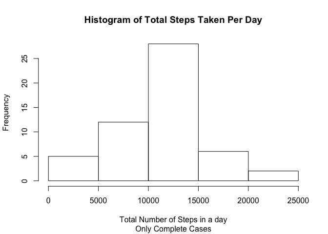

# Reproducible Research: Peer Assessment 1


## Loading and preprocessing the data


```r
# Libraries Used
library(plyr)
library(lubridate)
```


```r
# Read the data from the directory
data <- read.csv("activity.csv", header=TRUE, na.strings = "NA")

# Convert the date column to date format
data$date <- as.Date(data$date, format = "%Y-%m-%d")

# Remove NAs for first part of assignment
dataComplete <- data[complete.cases(data),]
```

## What is mean total number of steps taken per day?

```r
# Aggegate total steps per day
totalSteps <- aggregate(steps  ~ date, 
                        FUN=sum, 
                        data=dataComplete)

# Histogram of total steps taken per day

hist(totalSteps$steps,
     main="Histogram of Total Steps Taken Per Day",
     xlab="Total Number of Steps in a day",
     sub="Only Complete Cases")
```

 

```r
# Mean and median of total number of steps taken per day
meanSteps <- mean(totalSteps$steps)
medianSteps <- median(totalSteps$steps)

print(meanSteps)
```

```
## [1] 10766.19
```

```r
print(medianSteps)
```

```
## [1] 10765
```

## What is the average daily activity pattern?


```r
# Aggregate average steps taken over each interval
totalIs <- aggregate(steps  ~ interval, 
                     data=dataComplete, 
                     FUN="mean")

plot(totalIs$interval, totalIs$steps,
     type= "l",
     main="Average Daily Activity Pattern",
     xlab="Five Minute Interval",
     ylab= "Average Number of Steps")
```

 

```r
# Which interval has the highest number of steps?
totalIsMax <- totalIs[totalIs$steps == max(totalIs$steps),]
print(totalIsMax)
```

```
##     interval    steps
## 104      835 206.1698
```

## Imputing missing values


```r
# How many NAs appear in this dataset?
sum(is.na(data))
```

```
## [1] 2304
```

```r
# take mean daily steps calculated above and divide 
# by number of 5 minute intervals in a day (288)

newNA <- meanSteps/288
dataNAInput <- data
dataNAInput[is.na(dataNAInput)] <- newNA

# New histogram of total number of steps taken each day
totalStepsNA <- aggregate(steps  ~ date, 
                        FUN=sum, data=dataNAInput)
hist(totalStepsNA$steps,
     main="Histogram of Total Steps Taken Per Day",
     sub="NA Values Replaced with Daily Average/Number of Intervals",
     xlab="Total Number of Steps in a day")
```

 

```r
# Mean and Median of total steps per day
meanStepsNA <- mean(totalStepsNA$steps)
medianStepsNA <- median(totalStepsNA$steps)

print(meanStepsNA)
```

```
## [1] 10766.19
```

```r
print(medianStepsNA)
```

```
## [1] 10766.19
```

Inputing the daily average divided by the number of intervals in a day increased the median of the daily steps taken each day. As expected, the mean remains unchanged.

## Are there differences in activity patterns between weekdays and weekends?


```r
# Find the day of the week using lubridate
data$date <- ymd(data$date)
data$day <- paste(wday(data$date))

# Create two datasets - one for the weekend, one for the weekday
# day = 1 (Sunday) or 7 (Saturday)
weekend <- data[ which(data$day== 1 
                         | data$day == 7), ]
weekday <- data[which(data$day >= 2 | data$day <= 6), ]

# Compute average across all days for intervals
totalIsWeekend <- aggregate(steps  ~ interval, 
                     data=weekend, 
                     FUN="mean")
totalIsWeekday <- aggregate(steps  ~ interval, 
                     data=weekday, 
                     FUN="mean")
# Plot weekend and wekday in panels
par(mfrow = c(2,1), mar = c(5, 4, 2, 1))

plot(totalIsWeekday$interval, totalIsWeekday$steps,
     type= "l",
     main="Average Daily Activity Pattern - Weekday",
     xlab="Five Minute Interval",
     ylab= "Average Number of Steps")
plot(totalIsWeekend$interval, totalIsWeekend$steps,
     type= "l",
     main="Average Daily Activity Pattern - Weekend",
     xlab="Five Minute Interval",
     ylab= "Average Number of Steps")
```

 

